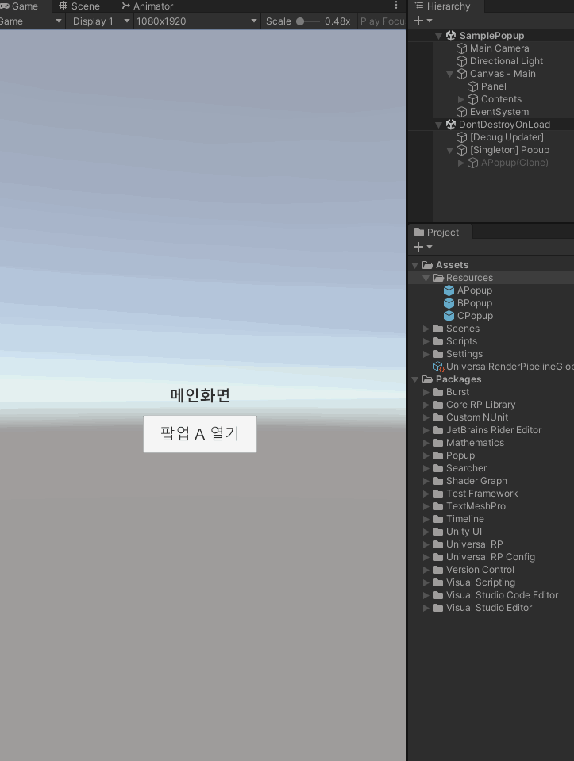

# Popup

### 소개
'Screen Space - Overlay' 기반에서 동작하는 단순한 팝업 시스템 입니다.



### 설치방법
1. 패키지 관리자의 툴바에서 좌측 상단에 플러스 메뉴를 클릭합니다.
2. 추가 메뉴에서 Add package from git URL을 선택하면 텍스트 상자와 Add 버튼이 나타납니다.
3. https://github.com/DarkNaku/Popup.git 입력하고 Add를 클릭합니다.

### 사용법

1. 게임 오브젝트에 Popup 클래스를 추가합니다.(없더라도 런타임에 호출하면 자동으로 게임오브젝트가 생성됩니다.)
2. PopupHandler 클래스를 상속받은 팝업 핸들러를 만들고 위에서 만든 게임 오브젝트의 자식으로 추가합니다.
3. PopupHandler가 붙어 있는 게임오브젝트 이름을 키로하여 Popup.Show, Popup.Hide API를 통해 열고 닫을 수 있습니다.
4. 호출시 등록되지 않은 경우 리소스 폴더에서 키로 받은 경로를 찾아 로드합니다.

예제 코드를 받아 확인해보실 수 있습니다.

사용 예제 코드

```csharp
Popup.MainCanvas = _mainCanvas; //메인 켄버스를 등록해야 팝업이 메인 켄버스 보다 높은 SortingOrder를 가지고 열릴 수 있습니다.

Popup.Show<APopup>("APopup")    // 팝업 열기
    .SetParameter(456)          // 매개변수 전달
    .OnWillHide((result) => Debug.LogFormat("B 팝업이 닫혔습니다. 결과 : {0}", result.Result0));    // 닫았을 때 콜백 등록

Popup.Hide<APopup>(this)    // 팝업 닫기
    .SetResult(111);        // 결과 전달
```

### 추가설명
* IPopupTransition을 사용한 등장 및 퇴장 연출 예제 추가 예정